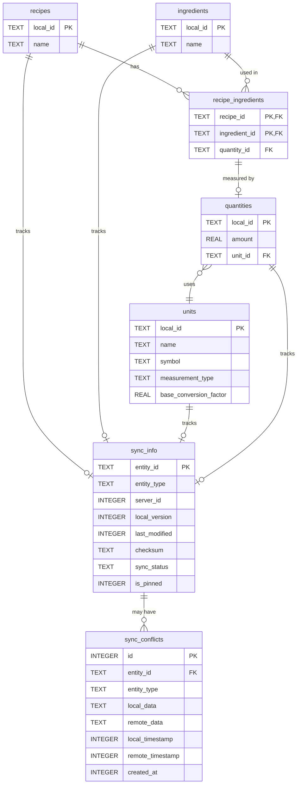
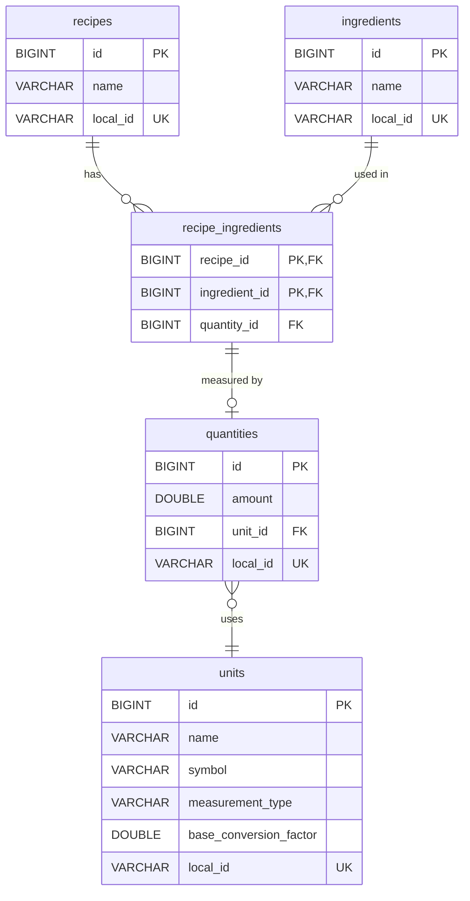
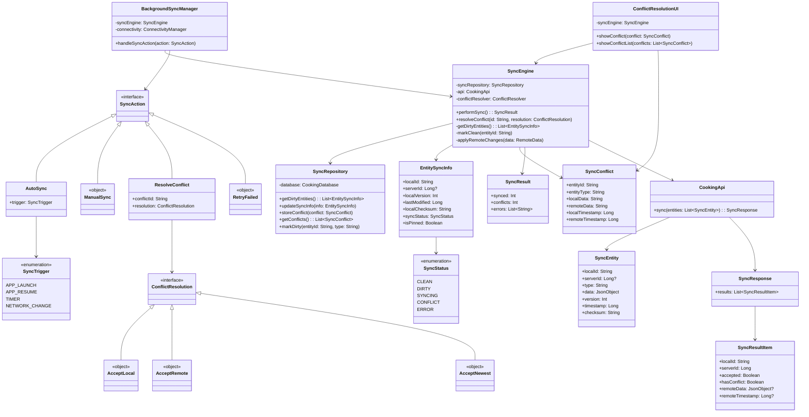
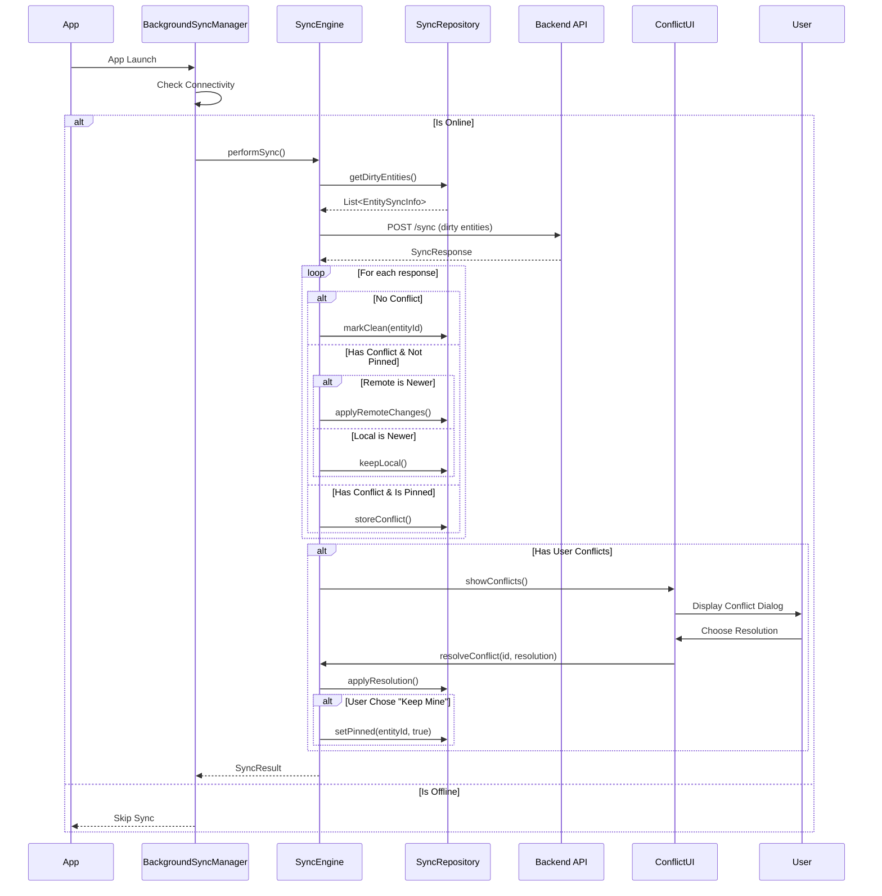
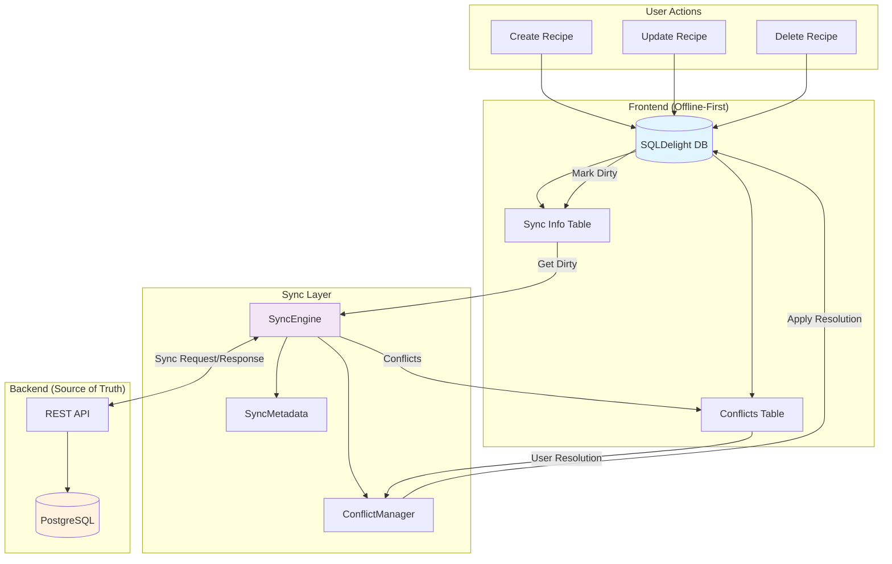
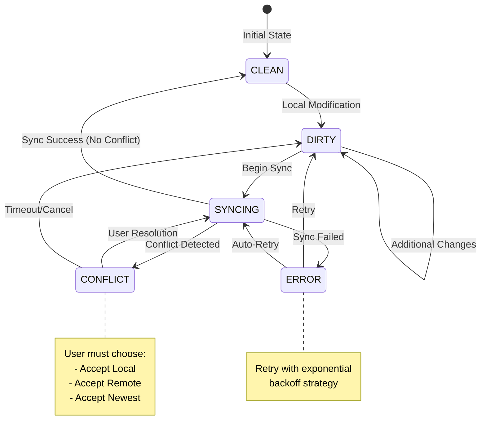
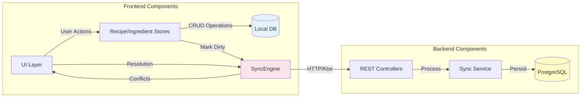
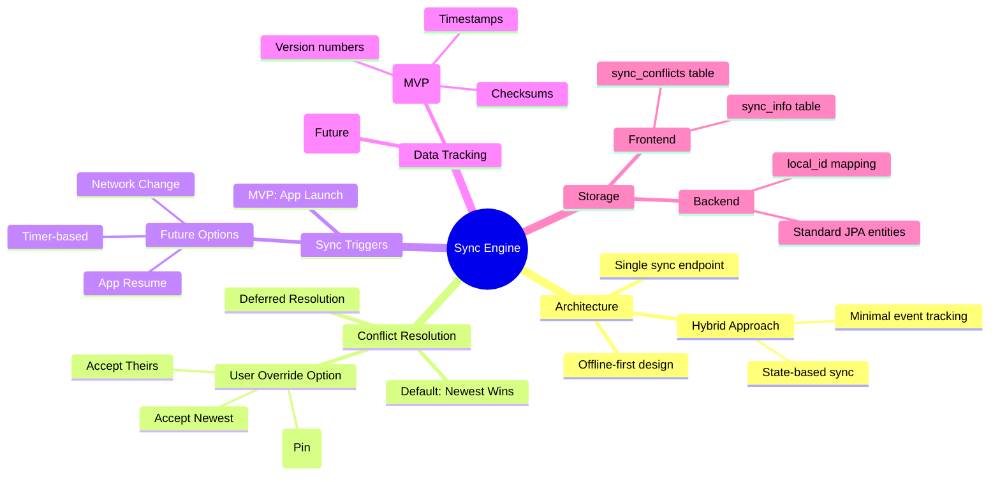

# Sync Architecture Diagrams

## Database Schema ERD

### Frontend (SQLDelight) Schema

### Backend (Spring/JPA) Schema

## UML Class/Component Diagram

### Core Sync Architecture

## Sync Flow Sequence Diagram

## Data Flow Architecture

## State Machine for Entity Sync Status

## Component Interaction Overview

## Key Design Decisions Visualized

These diagrams show:

1. **ERD**: The database relationships and how sync metadata connects to domain entities
2. **Class Diagram**: The object-oriented structure with sealed interfaces for extensibility
3. **Sequence Diagram**: The sync flow from app launch through conflict resolution
4. **Data Flow**: How data moves between frontend, sync layer, and backend
5. **State Machine**: The lifecycle of entity sync status
6. **Component Overview**: High-level system architecture
7. **Design Decisions**: Mind map of key architectural choices

The architecture prioritizes:
- **Simplicity**: Single sync point, clear state transitions
- **Extensibility**: Sealed interfaces allow adding features later
- **User Control**: Automatic resolution with override capability
- **Offline-First**: Local DB is primary, sync is opportunistic